# ✨ t-Sort : Trash Sort adalah Klasifikasi Otomatis Sampah Organik & Anorganik Menggunakan InceptionV3 & MobileNetV2 ✨

## Latar Belakang & Tujuan
Pengelolaan sampah merupakan tantangan global yang terus meningkat, terutama di negara-negara berkembang, di mana sistem pengelolaan limbah sering kali belum memadai. Sampah yang tidak dikelola dengan baik dapat mencemari lingkungan, merusak ekosistem, dan membahayakan kesehatan manusia. Salah satu solusi penting adalah mendaur ulang sampah seperti plastik, kertas, dan logam, sekaligus memastikan pengelolaan limbah B3 (Bahan Berbahaya dan Beracun) secara aman. Namun, proses klasifikasi sampah sering kali menjadi kendala utama karena metode manual memerlukan banyak waktu dan tenaga, serta rentan terhadap kesalahan.

Untuk mengatasi masalah ini, teknologi berbasis machine learning, khususnya deep learning, dapat digunakan untuk mengotomatisasi proses klasifikasi sampah dengan lebih cepat dan akurat. Algoritma Convolutional Neural Network (CNN) telah terbukti efektif dalam pengenalan pola pada citra, sehingga dapat dimanfaatkan untuk mengenali dan mengklasifikasikan berbagai jenis sampah berdasarkan karakteristik visualnya. Arsitektur ResNet50, yang memiliki kemampuan unggul dalam mengatasi masalah overfitting dan vanishing gradient, memungkinkan model untuk mempelajari fitur kompleks dengan lebih baik melalui teknik transfer learning.

Penerapan teknologi ini diharapkan mampu mendukung sistem pengelolaan sampah yang lebih efisien dan ramah lingkungan. Dengan mengotomatisasi klasifikasi sampah, teknologi machine learning dapat membantu mengurangi dampak negatif sampah terhadap lingkungan dan kesehatan, sekaligus meningkatkan efektivitas daur ulang serta pengelolaan limbah B3. Solusi ini tidak hanya relevan untuk skala lokal, tetapi juga dapat diadaptasi secara global untuk menghadapi krisis sampah yang semakin besar.

**Link Dataset yang digunakan:** [Garbage Dataset](https://www.kaggle.com/datasets/sumn2u/garbage-classification-v2).

**InceptionV3 Architecture**
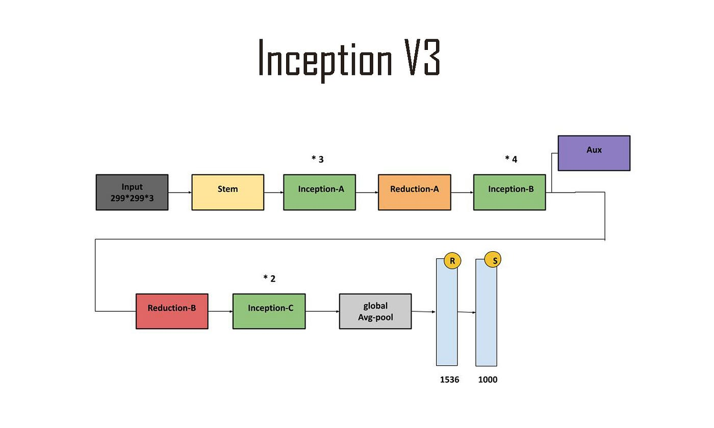

InceptionV3 adalah model CNN canggih dari Google yang dirancang untuk klasifikasi gambar dengan efisiensi tinggi. Model ini menggunakan modul Inception yang menggabungkan berbagai ukuran kernel konvolusi, memungkinkan deteksi pola pada berbagai skala. Dengan transfer learning, InceptionV3 dapat diadaptasi untuk mengenali berbagai jenis sampah, seperti plastik, kertas, dan logam, dengan akurasi tinggi. Model ini cocok untuk dataset kompleks yang membutuhkan analisis mendalam terhadap detail visual.

**MobileNetV2 Architecture**
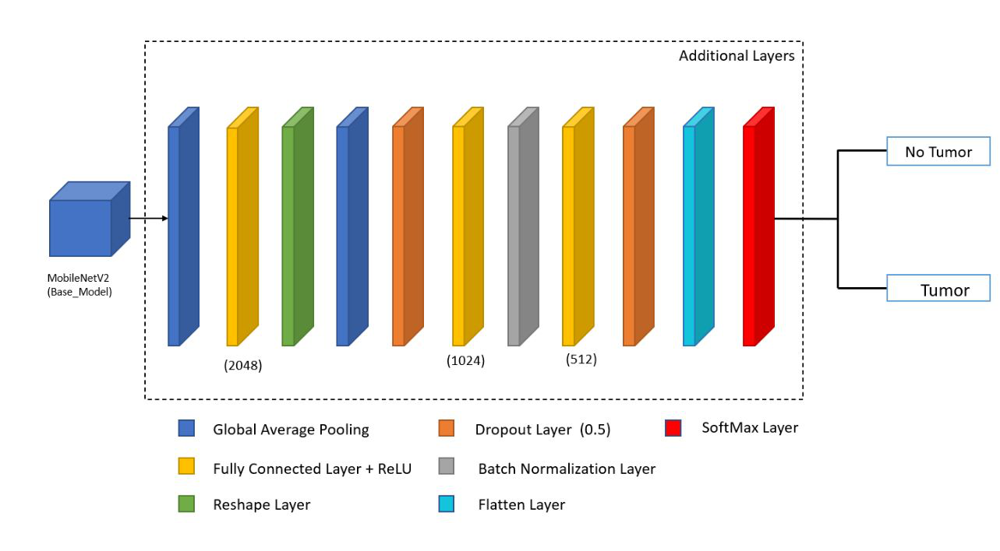

MobileNetV2 adalah model CNN ringan yang dirancang untuk perangkat dengan sumber daya terbatas. Menggunakan blok inverted residual dan depthwise separable convolution, model ini sangat efisien dalam memproses citra tanpa mengorbankan akurasi. MobileNetV2 ideal untuk aplikasi real-time seperti pemilahan sampah otomatis berbasis perangkat seluler, dengan kecepatan prediksi tinggi dan kebutuhan komputasi rendah.

## Dependensi & Langkah Instalasi 📃
dependencies = ["tensorflow>=2.18.0", "joblib>=1.4.2", "scikit-learn>=1.6.0", "streamlit>=1.41.1"]

install tensorflow di pdm =
- pdm info -> pastikan sudah berada di .venv
- pdm run python -m pip show tensorflow -> cek tensorflow apakah sudah di .venv
- pdm run python -m ensurepip --upgrade
- pdm run python -m pip install tensorflow
- pdm run python -c "import tensorflow as tf; print(tf._version_)"

## Struktur File 📄
- **app.py**: Berkas aplikasi utama yang berisi rute dan fungsi.
- **klasifikasi_sampah.py**: Berkas penerapan dari model untuk klasifikasi dan tampilan antarmuka web.

## Menjalankan App 💻
- Jalankan skrip dengan streamlit run ./src/app.py
- Akses aplikasi di peramban Web dengan alamat http://localhost:8501/

**Model Evaluation**

### InceptionV3 Model ✨

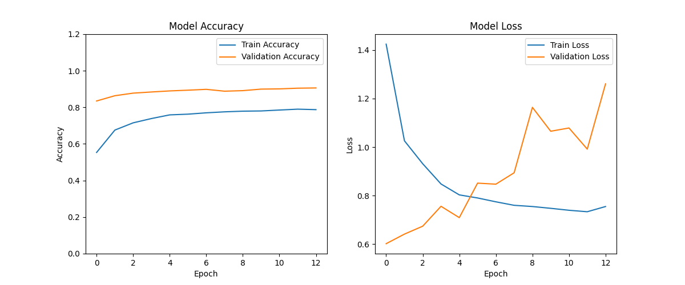

Plot diatas menunjukkan bahwa *Model Accuracy* cukup stabil dalam proses training, namun *Model Loss* mengalami **overfitting* yang ditandai dengan grafik berfluktuasi yang tidak wajar.

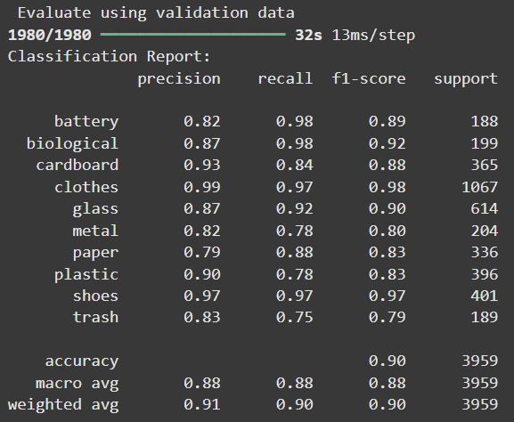

Gambar diatas menunjukkan *Classification Report* dari Model InceptionV3 menghasilkan nilai akurasi sebesar *90%* yang dapat digolongkan cukup optimal.

Confusion Matrix tersebut menunjukkan bahwa model mampu memprediksi citra dengan cukup baik dengan kesalahan yang tidak terlalu signifikan.

### MobileNetV2 Model ✨

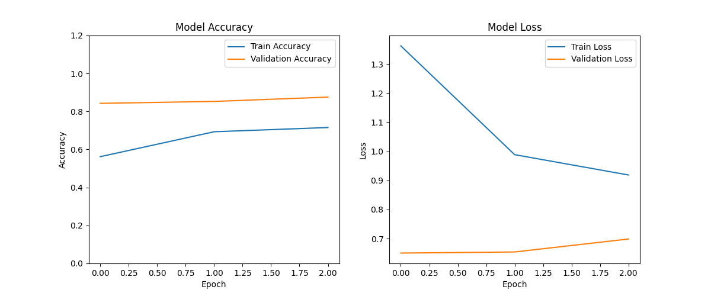

Plot diatas menunjukkan bahwa *Model Accuracy* cukup stabil dalam proses training dan *Model Loss* sudah dalam kategori cukup baik dibuktikan dengan grafik yang tidak fluktuatif.

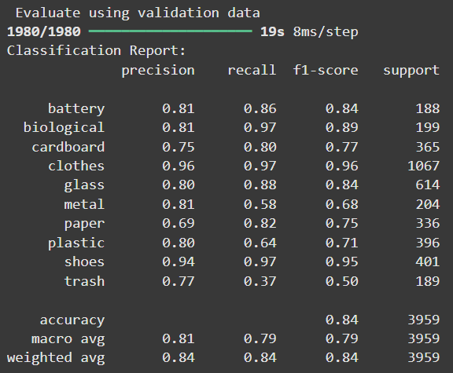

Gambar diatas menunjukkan *Classification Report* dari Model InceptionV3 menghasilkan nilai akurasi sebesar **84%** yang dapat digolongkan cukup optimal.

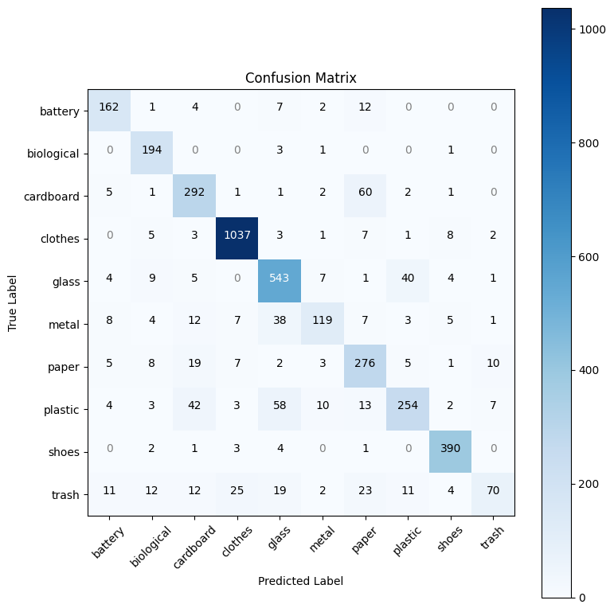

Confusion Matrix tersebut menunjukkan bahwa model mampu memprediksi citra dengan cukup baik dengan kesalahan yang tidak terlalu signifikan.

## Local Web Deployment

### Tampilan HomePage

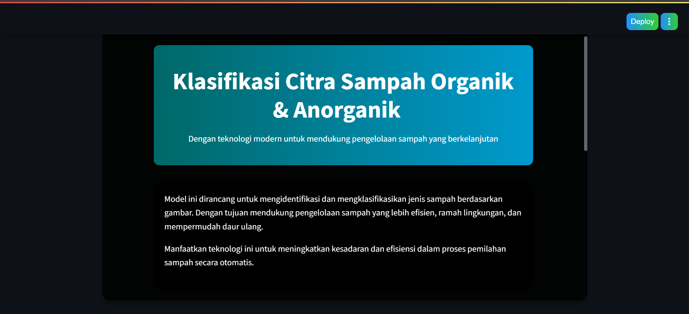
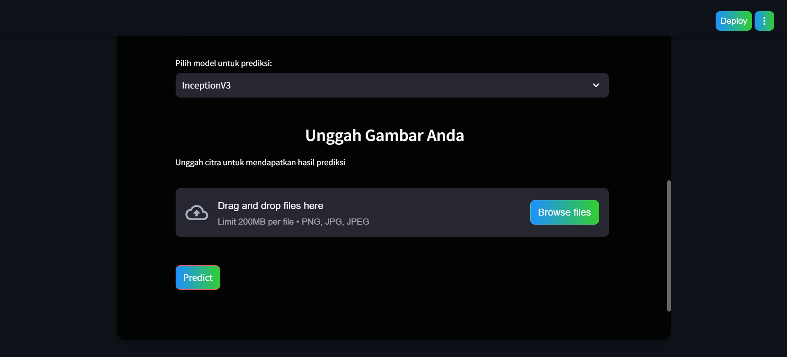

### Tampilan HomePage Setelah Upload Image

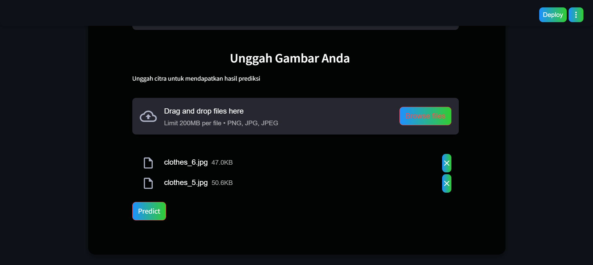

### Tampilan Prediction Result

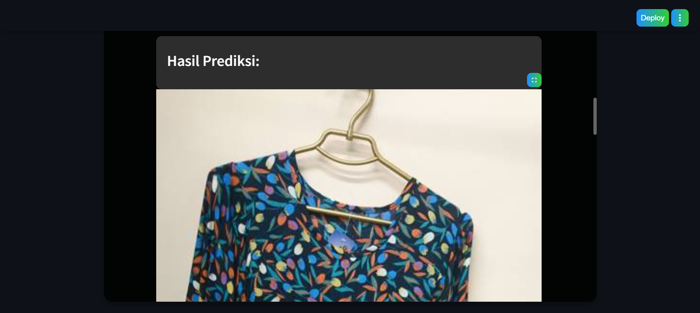
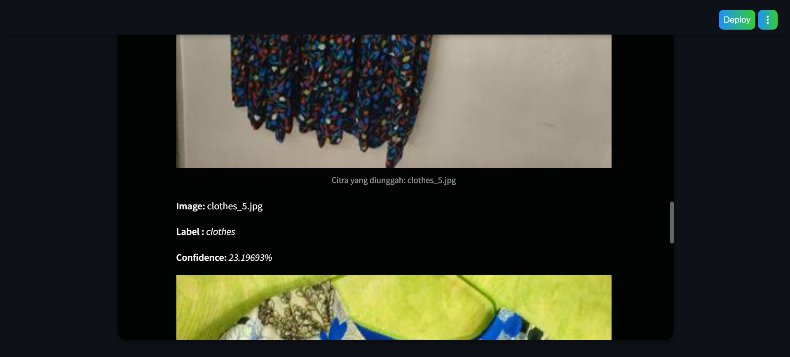
