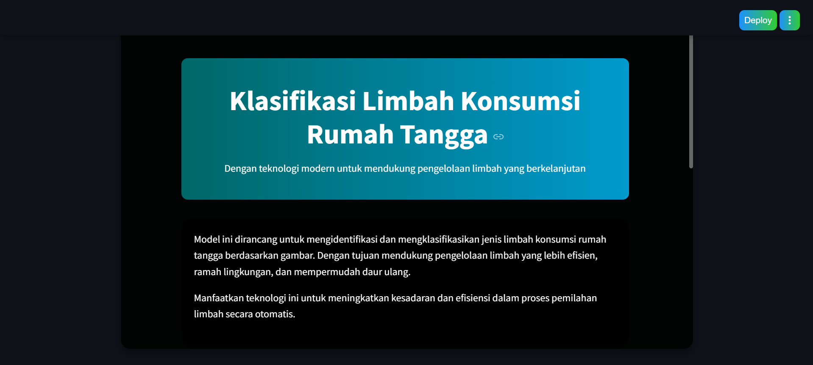
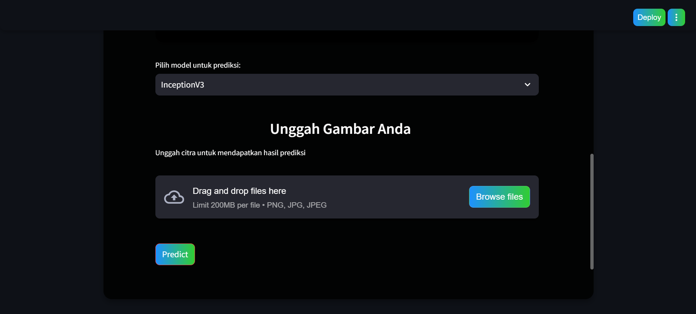
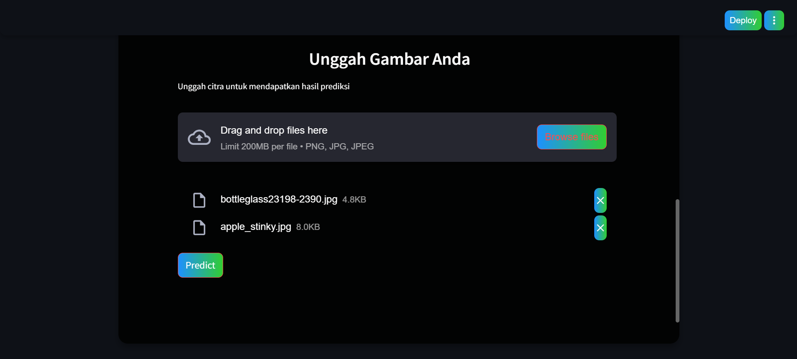
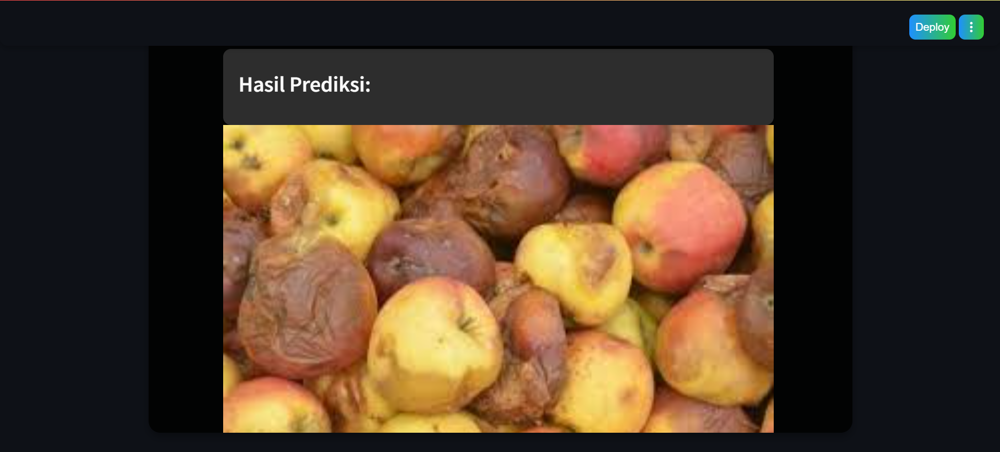
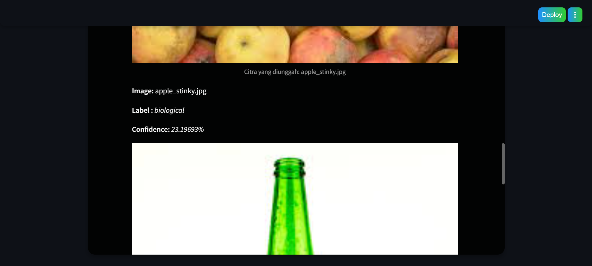
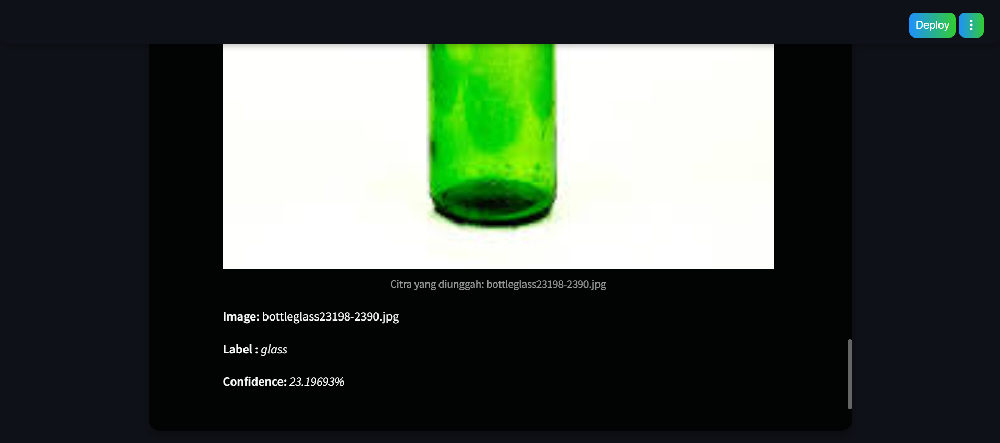

# ✨ wasteIt : Klasifikasi Otomatis Limbah Konsumsi Rumah Tangga Menggunakan InceptionV3 & MobileNetV2 ✨

## Latar Belakang & Tujuan
Pengelolaan limbah rumah tangga menjadi tantangan besar karena dapat mencemari lingkungan dan membahayakan kesehatan. Daur ulang sampah seperti plastik dan sisa makanan penting, tetapi metode manual sering lambat dan kurang akurat. 

Teknologi machine learning, seperti CNN dengan arsitektur InceptionV3 dan MobileNetV2, dapat mengotomatisasi klasifikasi sampah secara cepat dan akurat, mendukung daur ulang yang efisien. Solusi ini membantu mengurangi dampak negatif limbah rumah tangga sekaligus meningkatkan pengelolaan sampah berkelanjutan secara lokal dan global.

**Link Dataset yang digunakan:** [Garbage Dataset](https://www.kaggle.com/datasets/sumn2u/garbage-classification-v2).

**InceptionV3 Architecture**

InceptionV3 adalah model CNN canggih dari Google yang dirancang untuk klasifikasi gambar dengan efisiensi tinggi. Model ini menggunakan modul Inception yang menggabungkan berbagai ukuran kernel konvolusi, memungkinkan deteksi pola pada berbagai skala. Dengan transfer learning, InceptionV3 dapat diadaptasi untuk mengenali berbagai jenis sampah, seperti plastik, kertas, dan logam, dengan akurasi tinggi. Model ini cocok untuk dataset kompleks yang membutuhkan analisis mendalam terhadap detail visual.

**MobileNetV2 Architecture**

MobileNetV2 adalah model CNN ringan yang dirancang untuk perangkat dengan sumber daya terbatas. Menggunakan blok inverted residual dan depthwise separable convolution, model ini sangat efisien dalam memproses citra tanpa mengorbankan akurasi. MobileNetV2 ideal untuk aplikasi real-time seperti pemilahan sampah otomatis berbasis perangkat seluler, dengan kecepatan prediksi tinggi dan kebutuhan komputasi rendah.

## Dependensi & Langkah Instalasi 📃
dependencies = ["tensorflow>=2.18.0", "joblib>=1.4.2", "scikit-learn>=1.6.0", "streamlit>=1.41.1"]

1. wajib pdm init terlebih dahulu

2. install tensorflow di pdm =
- pdm info -> pastikan sudah berada di .venv
- pdm run python -m pip show tensorflow -> cek tensorflow apakah sudah di .venv
- pdm run python -m ensurepip --upgrade
- pdm run python -m pip install tensorflow
- pdm run python -c "import tensorflow as tf; print(tf._version_)"

## Struktur File 📄
- code/: Berkas kode ipynb dari model klasifikasi.
- src/uap/**app.py**: Berkas aplikasi utama yang berisi rute dan fungsi.
- src/uap/**klasifikasi_sampah.py**: Berkas penerapan dari model untuk klasifikasi dan tampilan antarmuka web.
- src/Model/: Berisi saved model berformat .h5 dari kedua arsitektur.

## Menjalankan App 💻
- Jalankan skrip dengan streamlit run ./src/app.py
- Akses aplikasi di peramban Web dengan alamat http://localhost:8501/

**Model Evaluation**

### InceptionV3 Model ✨

Plot diatas menunjukkan bahwa *Model Accuracy* cukup stabil dalam proses training, namun *Model Loss* mengalami *overfitting* yang ditandai dengan grafik berfluktuasi yang tidak wajar.

Gambar diatas menunjukkan *Classification Report* dari Model InceptionV3 menghasilkan nilai akurasi sebesar *90%* yang dapat digolongkan cukup optimal.

Confusion Matrix tersebut menunjukkan bahwa model mampu memprediksi citra dengan cukup baik dengan kesalahan yang tidak terlalu signifikan.

### MobileNetV2 Model ✨

Plot diatas menunjukkan bahwa *Model Accuracy* cukup stabil dalam proses training dan *Model Loss* sudah dalam kategori cukup baik dibuktikan dengan grafik yang tidak fluktuatif.

Gambar diatas menunjukkan *Classification Report* dari Model InceptionV3 menghasilkan nilai akurasi sebesar **84%** yang dapat digolongkan cukup optimal.

Confusion Matrix tersebut menunjukkan bahwa model mampu memprediksi citra dengan cukup baik dengan kesalahan yang tidak terlalu signifikan.

## Local Web Deployment

### Tampilan HomePage

### Tampilan HomePage Setelah Upload Image

### Tampilan Prediction Result

## Author 👨‍💻 
- Andrian Satrio B. | 202110370311518 (https://github.com/iambethaviaji)
